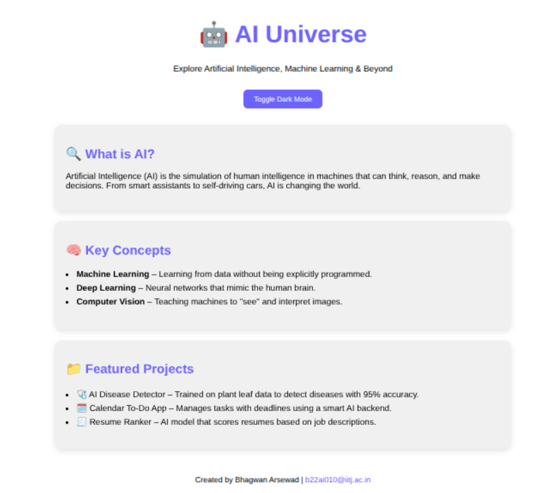
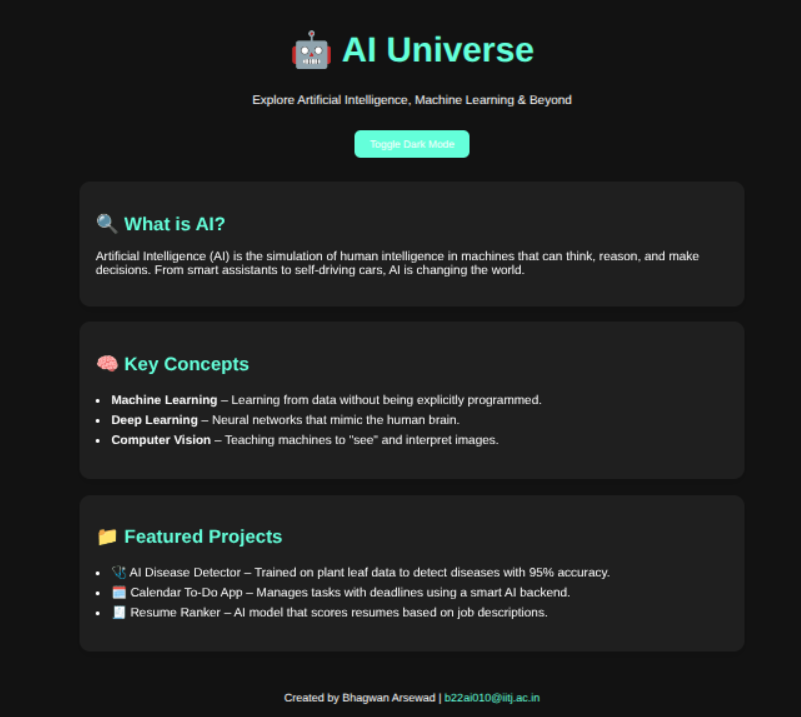

# 🤖 AI Universe

Welcome to **AI Universe** – a fully responsive, animated static website introducing the world of Artificial Intelligence.

🌐 **Live URL**: [https://bhagwan388.github.io](https://bhagwan388.github.io)

---

## 📌 Features

* 🌗 Light & Dark Mode toggle
* ⚡ Smooth animations with fade-in effect
* 📱 Mobile-friendly responsive layout
* 🧠 AI-focused sections: Intro, Concepts, Projects
* ☁️ 100% hosted on GitHub Pages

---

## 📷 Screenshots

### 💡 Light Mode



### 🌙 Dark Mode



---

## 🗂 Project Structure

```
AI Universe/
├── index.html       # Main HTML page
├── style.css        # CSS styling + dark mode
├── script.js        # JavaScript toggle logic
├── README.md        # This file
└── screenshots/     # Screenshots of the site
    ├── light.png
    └── dark.png
```

---

## 🧪 How to Run Locally

1. Clone this repo:

```bash
git clone https://github.com/bhagwan388/bhagwan388.github.io
cd bhagwan388.github.io
```

2. Open `index.html` in your browser
3. Edit and push changes to update your site live

---

## 📚 Internship Task Info

This project completes:

> **Internship Task 5: Deploy a Static Website Using GitHub Pages**
>
> * Understand version control
> * Learn static hosting & deployment workflow
> * Publish a live site for portfolio/demo

---

## 👨‍💼 Author

**Bhagwan Arsewad**
📧 [b22ai010@iitj.ac.in](mailto:b22ai010@iitj.ac.in)
🎓 B.Tech in AI & Data Science, IIT Jodhpur
🔗 [LinkedIn](https://www.linkedin.com/in/bhagwan-arsewad-0bb7b5279/)

---

## ✅ Live Website

🔗 [https://bhagwan388.github.io](https://bhagwan388.github.io)
